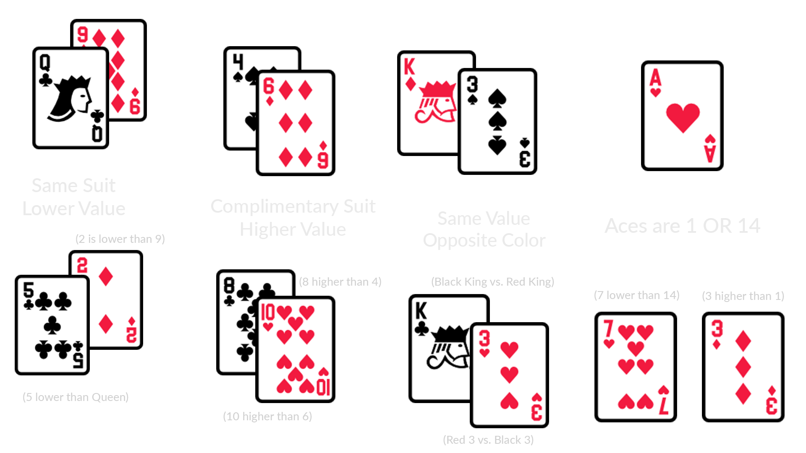

# Card Compare
[Play the Game](https://cardcompare.io/)

## Overview
Card Compare is a strategic single-player card game, originally created in real life and now transformed into a web game using React and TypeScript.

### How to Play
1. The game is played with 52 cards divided into 4 piles, with 4 cards in your hand.
2. Click a card from your hand and then the top card from one of the piles to compare.
3. Playing a card from your hand moves it to the discard pile, and the chosen pile card to the 'Cards to Pickup' pile.
4. End your turn by clicking [End Turn], which merges 'Cards to Pickup' with your hand for the next turn. 
5. The game requires strategic planning of moves.
6. When all four piles are empty, the discard pile becomes the new, sole pile to compare against. Play your cards wisely to ensure you can play as many as possible.

### Scoring
- **Score Calculation:** Score = [(Number of Cards Played + Bonus Points) x Number of Cards Played].
- **Higher Scores:** More cards played per turn increase the score.

### Bonus Points System
- **Flush Bonus:** Earn a bonus for playing multiple cards of the same suit. The bonus increases with more cards played.
- **Same Value Bonus:** Earn a bonus for playing multiple cards of the same value. More cards lead to a higher bonus.

### Understanding Legal Moves
- Rules are from the perspective of the card in your hand (bottom) compared to the card in the piles (top).
  

###Technology
I utilized React written in TypeScript with Vite for the frontend, and used Firebase Google Auth and Firestore for leaderboard storage.
